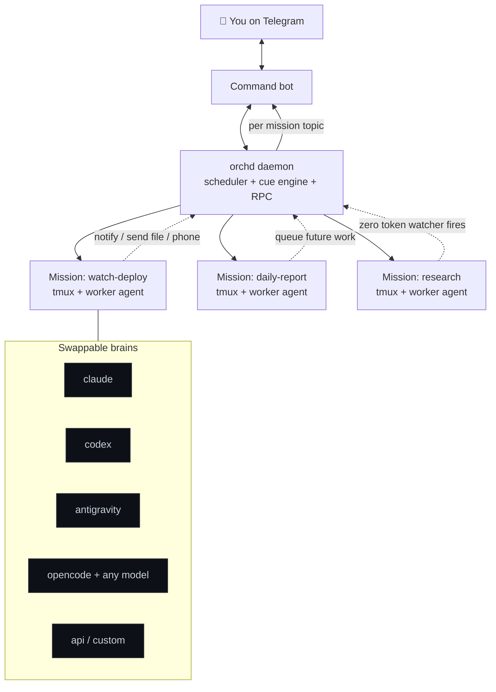

<div align="center">

# 🛰️ orch

### Your always on AI ops team, living in tmux and answering on Telegram

Delegate long running, stateful work to AI agents that run unattended on your own machine, keep their memory across days, and message you the moment they need you. One Telegram bot commands the whole fleet. Swap the brain behind any worker between Claude, Codex, Antigravity, OpenCode, or any model on OpenRouter, without losing the thread.


</div>

> **Note:** This project lived in local development from May to July 2026 and was migrated to GitHub in August 2026. The full build timeline is preserved in the commit history.

---

## The idea in one breath

You have work that does not fit in a single chat: watch a site for a week, run a daily routine, chase a deadline, babysit a long build, keep a project moving while you sleep. A normal AI chat forgets everything when you close the tab. **orch** turns each of those jobs into a **mission**: a persistent AI worker that lives in its own tmux session, remembers everything, wakes itself on a schedule, watches for conditions without burning tokens, and talks to you on Telegram like a colleague. When something truly needs you, it can even call your phone.

```
You (Telegram)  ->  one bot, one topic per mission  ->  a fleet of AI workers on your box
     ^                                                             |
     |__________ they notify, send files, and phone you  <_________|
```

You stay in the loop from your pocket. The work happens on your machine, on your terms, with your keys.

---

## Why people keep it running

- 🧠 **Missions that never forget.** Each mission is one long lived agent session in its own tmux. It survives reboots and resumes with full context on every wake.
- 📱 **Run the whole fleet from Telegram.** One bot. Every mission gets its own chat topic. Type in a topic and it goes straight to that worker. Its reply comes back in the same thread. Creating a topic creates a mission.
- 🔀 **Any agent, swappable live.** Claude Code, Codex, Antigravity, OpenCode, Gemini, a raw API key, or any custom CLI. Switch the brain of a running worker with one command and it migrates without losing the thread.
- 🌍 **Any model on the planet.** Point OpenCode at an OpenRouter key and pick from hundreds of models per mission, including free ones. Or run fully local through Ollama.
- ⏰ **They schedule themselves.** A worker can queue its own future work: "call me at 9am", "retry in 30 minutes", "follow up tomorrow".
- 👀 **Watchers that cost zero tokens.** Instead of polling, a worker writes a tiny script that sleeps until a condition fires, then wakes the agent only when it matters.
- ☎️ **Escalation by real phone call.** When a text is not enough, a worker rings your actual phone through a voice agent, reads its own context, asks the question, and relays your spoken answer back as a new instruction.
- 🗜️ **Cost control on autopilot.** When a session grows past a token threshold, orch compacts it so future wakes stay cheap. Live token sizes are one command away.
- 🔒 **Your box, your keys.** Everything runs on your machine. Secrets live in an encrypted per mission vault.

---

## Pick your brain

Every worker is powered by an **agent backend**. Choose one globally, or pin a different one to a single mission. Switching is live and the mission carries its memory over through an automatic handoff.

| Backend       | Runs on                                   | Resume | Compact | Notes |
|---------------|-------------------------------------------|:------:|:-------:|-------|
| `claude`      | Claude Code CLI                           |   ✅   |   ✅    | The reference backend, richest support |
| `codex`       | OpenAI Codex CLI                          |   ✅   |   ✅    | Isolated session store per mission |
| `antigravity` | Google Antigravity (`agy`)                |   ✅   |   ♻️    | Tools bridged through a shell toolkit |
| `opencode`    | OpenCode, open source                     |   ✅   |   ♻️    | **Any model** via `provider/model`, OpenRouter or local |
| `gemini`      | Gemini CLI                                |   ✅   |   ♻️    | Per mission workdir isolation |
| `api`         | **No CLI, just an API key**               |   ✅   |   ✅    | Anthropic, OpenAI, OpenRouter, Ollama, vLLM |
| `custom`      | Any agent CLI via two command templates   |   ✅   |   ♻️    | Plug in anything |

✅ native   ♻️ rebuild compaction (fresh session seeded with a handoff summary)

> **Sticky by design.** Whatever you set stays set. orch never swaps a backend behind your back. Turn on `agent_auto_fallback` if you want it to self heal to the last working agent after repeated dead turns.

---

## Quick start

```bash
git clone https://github.com/ankushsrivastava0626/mission-orchestrator orch
cd orch
./install.sh
```

The installer checks your dependencies, installs the CLIs, and launches an interactive setup wizard that:

1. asks which agent backend runs your workers,
2. takes a Telegram bot token from [@BotFather](https://t.me/BotFather) and **auto detects your chat id** the moment you message the bot,
3. optionally wires a Telegram group so each mission gets its own topic,
4. writes `~/.orch/orchd.env` and can install a systemd service so it survives reboots.

Then just message your bot:

```
/create watch-my-deploy
```

and start talking to it. That is it.

**Requirements:** Linux or macOS (Windows via WSL), Python 3.11 or newer, and `tmux`. Optional: `pass` and GnuPG for the secrets vault, and systemd for run at boot.

---

## How it fits together



The **daemon** owns a small SQLite database and a Unix socket. It schedules work, watches for conditions, and speaks to Telegram. Each **mission** is a worker agent in a tmux session that keeps its full memory and talks back through a scoped tool surface. The **agent adapter layer** means the core never assumes a specific CLI, so new backends drop in as a single file.

---

## Core concepts

| Concept            | What it is |
|--------------------|-----------|
| **Mission**        | One persistent worker session in one tmux. Survives reboots, resumes with full context. |
| **Step**           | A directive in the mission's linear queue, gated by a **cue**. |
| **Cue**            | When a step fires: `immediate`, `on_current_complete` (jump the queue), `on_timeout`, or `at_time` (an absolute wall clock time, so workers can plan the future). |
| **Heartbeat**      | A periodic "report your status" nudge. Daily by default. |
| **Scripted ping**  | A watcher script the worker writes and tests once. It polls a condition on its own for zero tokens and wakes the agent only when it fires. A watchdog re tasks the worker if the script dies. |
| **Auto compaction**| When an idle worker crosses a token threshold, orch compacts the session so future wakes stay cheap. |
| **Vault**          | Per mission secrets in `pass` and GnuPG. Workers read them with `msec`. Values never travel through tool responses. |

---

## Telegram is the whole cockpit

One bot from BotFather gives you:

- **Commands with menus:** `/missions`, `/m <id>`, `/create <name>`, `/context` (live token sizes across every mission), `/agent` (view or switch the backend), `/pane`, `/events`, plus inline keyboards for every action.
- **Topics mode:** point orch at a forum group and every mission gets its own topic. Talk in a topic to reach that worker. Its replies come back in thread. **Create a topic and orch spins up a mission bound to it.**
- **Per mission model picker:** choose `opencode` on a mission and pick the model from recently used buttons or type any OpenRouter id like `tencent/hy3:free`.
- **Attachments both ways:** send an image or any file to a worker, or receive one back. Images preview inline.
- **Human touches:** typing indicators, rapid messages coalesced into one, a per mission calling name for phone calls, and live location capture.

---

## The command line

| Command   | What it does |
|-----------|--------------|
| `orchd`   | The daemon. `orchd setup`, `orchd start`, `orchd status`. |
| `orchctl` | Admin from the shell. Create missions, add steps, switch or pin agents, and change any setting live. |
| `orch-mcp`| The MCP server, in host mode or worker mode. |
| `owatch`  | Heartbeat, fire, and ready calls used by scripted watcher scripts. |
| `msec`    | Worker side secret and cookie reader. |
| `oworker` | The full worker toolkit as plain shell commands, for backends without native MCP. |

A few favorites:

```bash
orchctl agent show                 # what backends are usable on this machine
orchctl agent set opencode         # switch the global brain, live
orchctl agent pin research codex   # pin one mission to a different backend
orchctl config set auto_compact_threshold 150000   # tune anything, no restart
orchctl config list                # every setting, current value, and default
```

---

## Drive it from another AI

Any MCP capable assistant can be the **host** that creates missions and reads a worker to host mailbox, even over SSH. Workers get their own scoped tool surface automatically:

`notify` `send_file` `talk_to_user` `message_host` `queue.*` `pings.*` `heartbeat.*` `get_user_location` `mission.status`

This is how one Claude can quietly run a team of other agents on a remote box and check in on them whenever you ask.

---

## Extras

### ☎️ Voice escalation (`extras/jami-voice/`)

When a text will not do, a worker places a real ringing call to your phone over [Jami](https://jami.net), a peer to peer network that needs no phone number. The voice agent reads the mission's context, asks the question in its own voice, and relays your spoken answer back to the worker as a new step. Full reference implementation included, from the audio routing to the escalation protocol.

---

## Configuration at a glance

Everything lives in one env file (`~/.orch/orchd.env`) and every tunable is changeable live with `orchctl config set`:

- auto compaction threshold, check interval, and cooldown
- rapid message coalescing window
- heartbeat defaults and limits
- agent health and fallback behavior
- handoff document sizing
- all backend binaries, keys, and Telegram wiring

---

## Security notes

Workers run with full access on your machine by design. They are your agents doing real work with your tools. Isolation between missions is logical, through scoped tools and separate sessions and topics, not an operating system sandbox. Do not run untrusted directives, and keep the box you trust the box that runs orch.

---

## License

MIT. See [LICENSE](LICENSE). Built to be forked, extended, and made your own.

<div align="center">

**Built for people who want an AI team that keeps working after they close the laptop.**

If this is useful, a ⭐ helps other builders find it.

</div>
